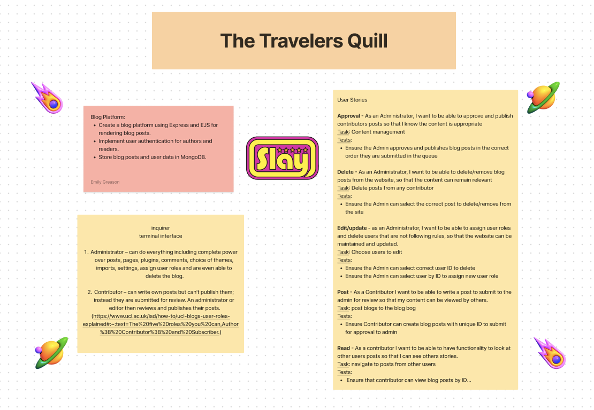
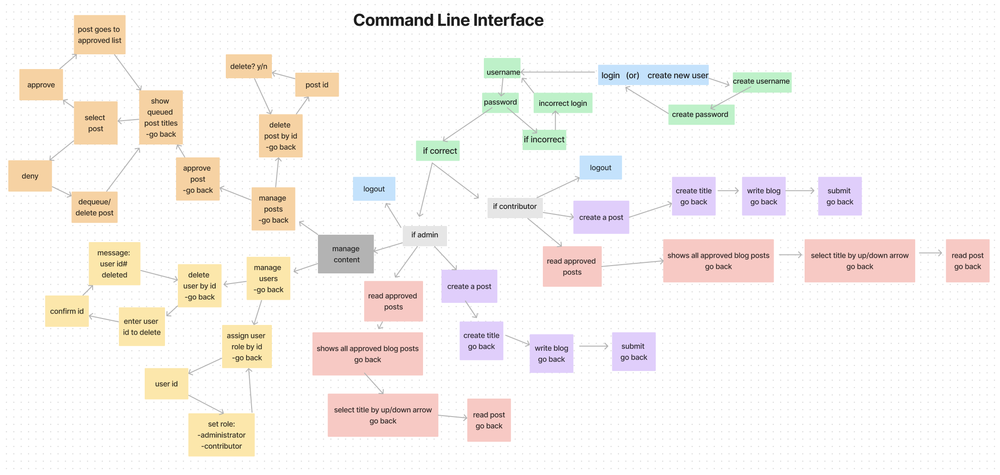
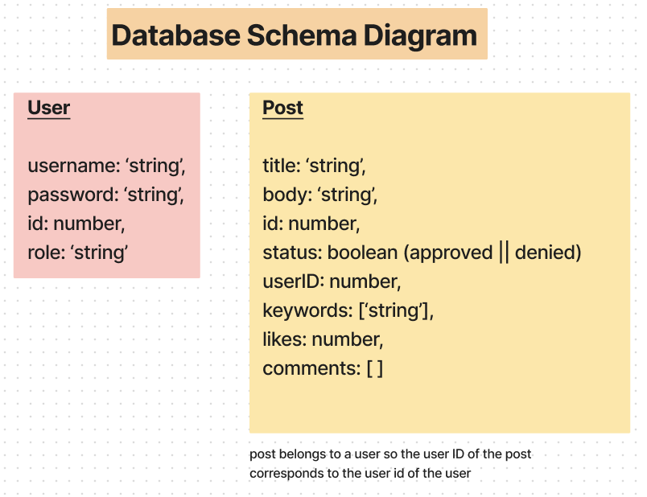

# Tech-enigmas

## Authors: Emily, Josh, Christina

### The Traveler's Quill - description

- A backend blog platform using Express that implements user authentication for administrator (read, write, update, delete) and contributors(read, write, submit for publication). Blog posts will use CRUD functionality and store user data in MongoDB

*hello*